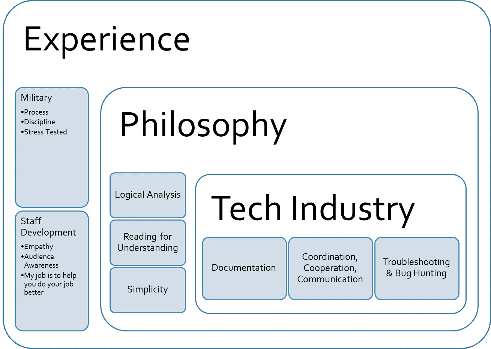

# Simple | Efficient | User Focus

I am a budding developer, user advocate, and a QA Analyst by trade. I believe that everything we build should be simple both in code and in use, elegant, and useful. I am currently an undergraduate student in the Computer Science department at UNM.  

More information about me and my work can be found in my [LinkedIn](https://www.linkedin.com/in/alana-chigbrow-03a40996/).     

[Resume](resume.md)   

# Experience
I have engaged with a number of career fields, from working a livestock auction to Sonic carhop to helicopter mechanic and soldier to legal assistant to Product Training Management. Each job I've held has taught me valuable professional skills. Discipline, process development, leadership, and empathy for the user.

* Intern Developer at Lavu
  * Implement bug fixes and product improvments using PHP, JavaScript, and MYSQL
* Quality Assurance Analyst at Lavu, Inc.
  * Acceptance testing, regression testing, smoke testing
  * Hybrid Developer/QA troubleshooting
* Java/Android Developer at Deep Dive Coding Bootcamp
  * Developed Android applications and server-side interfaces
* Product Training Manager at Lavu, Inc.
  * Employee and customer Product Training,  Product Documentation, and UAT Testing Program Development
  
  
